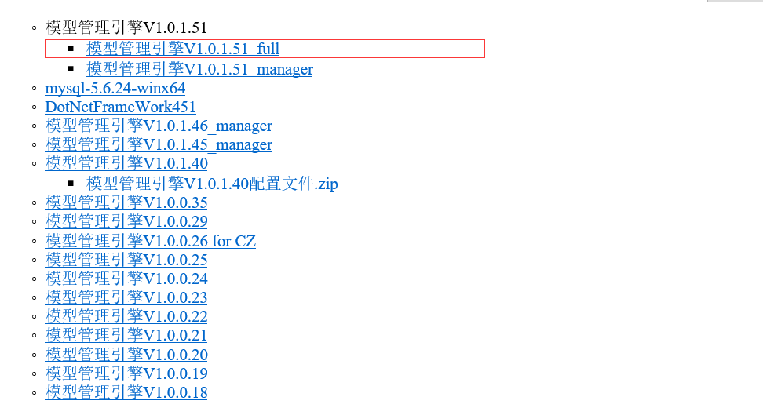
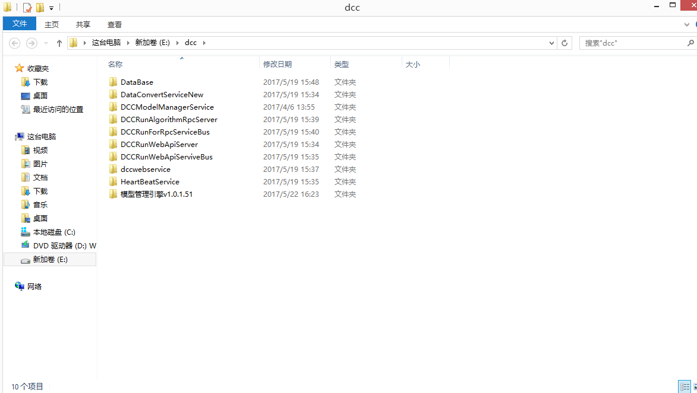
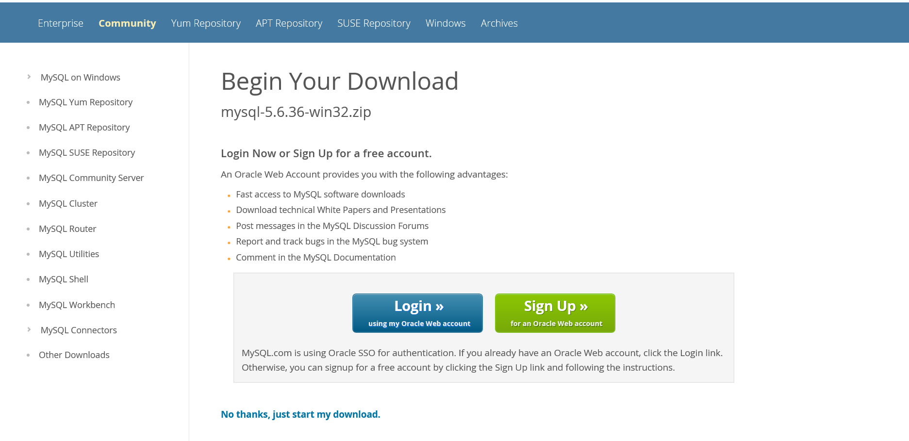
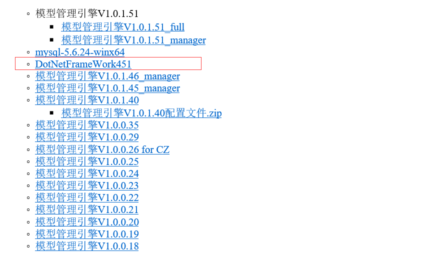
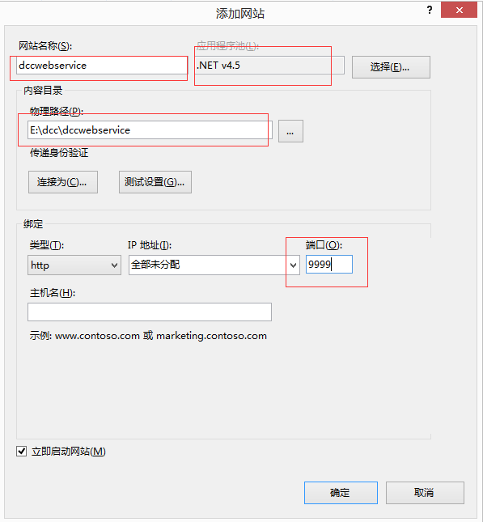
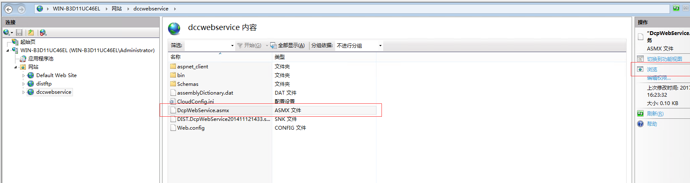
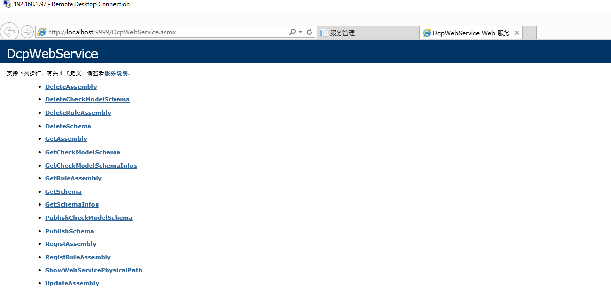
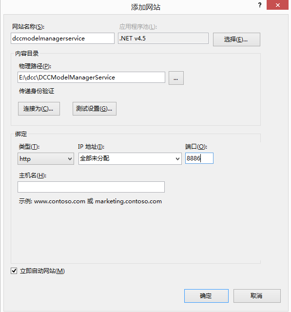
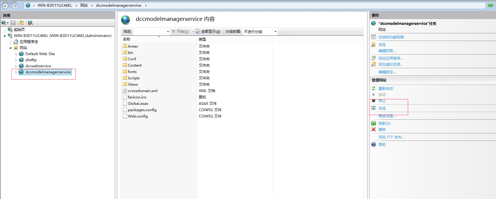
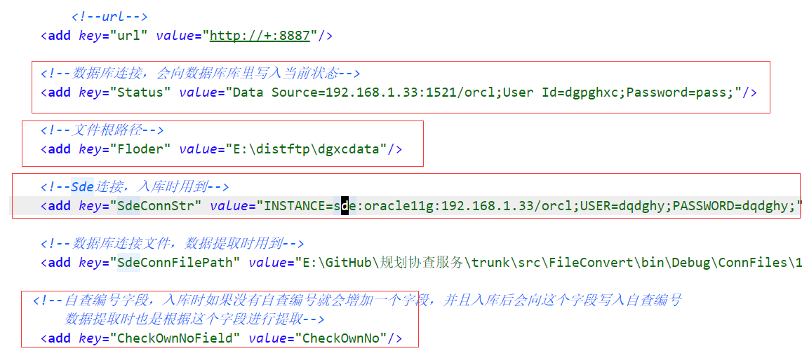

# 模型管理引擎安装部署文档
## 目录
0. 部署架构图
1. 下载模型管理引擎部署文件
2. 安装ArcGIS Engine及Oracle 32位客户端
3. 安装ArcGIS Server及Oracle 64位客户端
4. 安装Mysql 5.6
5. 安装.Net4.5
6. 安装IIS
7. 安装FTP
8. 安装模型管理Web服务
9. 安装模型管理代理服务
10. 安装心跳检测服务
11. 安装数据转换服务
12. 安装模型计算服务Monitor
13. 安装算子服务Monitor
14. 安装算子服务
15. 安装模型计算服务

## 部署架构图
待完善
## 下载模型管理引擎部署文件
从公司服务器上下载安装文件，版本是5.6.24 点击
 [http://192.168.200.113:8886/](http://192.168.200.113:8886/),进入后点击"下载"，如图：
 
 进入下载页面，也可以直接访问[http://192.168.200.115:9998/version/](http://192.168.200.115:9998/version/),如图：
 

 将下载后的文件解压缩，后如下图所示，这里存在E盘的dcc文件夹下，通常我们一般放在d盘或者e盘的dcc文件夹下，如图：
 

 注意，保障DataBase目录下的sql脚本所在的路径中不要出现中文
## 安装ArcGIS Engine及Oracle 32位客户端
可以参考其他同类文档
## 安装ArcGIS Server及Oracle 64位客户端
可以参考其他同类文档
## 安装Mysql 5.6
目前5.6的最新版本是5.6.36，我们产品中使用的是5.6.24，均可以
### 1.下载MySQL服务器端部署文件
可以选择从官网下载和从公司服务器下载两种方式；
* 从官方网站下载安装文件，版本是5.6.36
：[https://dev.mysql.com/downloads/file/?id=468784](https://dev.mysql.com/downloads/file/?id=468784)，
下载界面如图：


可以选择登陆账户后下载，也可以直接点击"No thanks,just start my download"进行下载，下载后是一个zip压缩文件
* 从公司服务器上下载安装文件，版本是5.6.24 点击
 [http://192.168.200.113:8886/](http://192.168.200.113:8886/),进入后点击"下载"，如图：
 
 进入下载页面，也可以直接访问[http://192.168.200.115:9998/version/](http://192.168.200.115:9998/version/),如图：
 
### 2.安装Mysql服务器
上一步下载的是一个mysql的zip压缩包，将该压缩包解压，如解压至C盘的根目录，可以根据情况设置，默认约定为C盘,解压缩，如图


修改配置文件，可将my-default.ini 复制一份，重命名为my.ini文件，也可以新建my.ini文件，文件中需要修改或者配置如下内容，特别注意
```
# These are commonly set, remove the # and set as required.
basedir = C:\mysql-5.6.24-winx64\mysql-5.6.24-winx64
datadir = C:\mysql-5.6.24-winx64\mysql-5.6.24-winx64\data
```
配置后，my.ini文件如下
```
# For advice on how to change settings please see
# http://dev.mysql.com/doc/refman/5.6/en/server-configuration-defaults.html
# *** DO NOT EDIT THIS FILE. It's a template which will be copied to the
# *** default location during install, and will be replaced if you
# *** upgrade to a newer version of MySQL.
[client]
default-character-set=utf8

[mysqld]
#default-character-set=utf8
# Remove leading # and set to the amount of RAM for the most important data
# cache in MySQL. Start at 70% of total RAM for dedicated server, else 10%.
innodb_buffer_pool_size = 128M

# Remove leading # to turn on a very important data integrity option: logging
# changes to the binary log between backups.
# log_bin
#绑定IPv4和3306端口
bind-address = 0.0.0.0
# These are commonly set, remove the # and set as required.
basedir = C:\mysql-5.6.24-winx64\mysql-5.6.24-winx64
datadir = C:\mysql-5.6.24-winx64\mysql-5.6.24-winx64\data

port = 3306
server_id = 1

character_set_server=utf8
max_connections=100
default-storage-engine=InnoDB

max_allowed_packet=256M

# Remove leading # to set options mainly useful for reporting servers.
# The server defaults are faster for transactions and fast SELECTs.
# Adjust sizes as needed, experiment to find the optimal values.
join_buffer_size = 128M
sort_buffer_size = 2M
read_rnd_buffer_size = 2M 

#GTID
gtid_mode=on
enforce_gtid_consistency=1
log-bin=mysql-bin
log_slave_updates=1

sql_mode=NO_ENGINE_SUBSTITUTION,STRICT_TRANS_TABLES 

```
管理员权限启动cmd或者PowerShell，这里以PowerShell为例，切换至mysql安装的bin路径下
```
PS C:\Users\Administrator> cd C:\mysql-5.6.24-winx64\mysql-5.6.24-winx64\bin
PS C:\mysql-5.6.24-winx64\mysql-5.6.24-winx64\bin>
```
运行mysqld -install
```
PS C:\mysql-5.6.24-winx64\mysql-5.6.24-winx64\bin> .\mysqld install
Service successfully installed.
PS C:\mysql-5.6.24-winx64\mysql-5.6.24-winx64\bin>
```
提示Service successfully installed,此时启动mysql服务，命令为
net start mysql，如下
```
PS C:\mysql-5.6.24-winx64\mysql-5.6.24-winx64\bin> net start mysql
MySQL 服务正在启动 .
MySQL 服务已经启动成功。

PS C:\mysql-5.6.24-winx64\mysql-5.6.24-winx64\bin>
```
同理，停止命令
```
net stop mysql
```
在环境变量的Path中加入mysql的bin目录
```
C:\mysql-5.6.24-winx64\mysql-5.6.24-winx64\bin
```
### 3.导入数据库
启动cmd，登陆数据库：
```
 mysql -h localhost -uroot -p
```
输入密码，该服务默认密码为"root"
输出：
```
Welcome to the MySQL monitor.  Commands end with ; or \g.
Your MySQL connection id is 2
Server version: 5.6.24-log MySQL Community Server (GPL)

Copyright (c) 2000, 2015, Oracle and/or its affiliates. All rights reserved.

Oracle is a registered trademark of Oracle Corporation and/or its
affiliates. Other names may be trademarks of their respective
owners.

Type 'help;' or '\h' for help. Type '\c' to clear the current input statement.
```
输入：
```
show databases
```
输出：
```
+--------------------+
| Database           |
+--------------------+
| information_schema |
| mysql              |
| performance_schema |
+--------------------+
3 rows in set (0.11 sec)
```
如果没有存在dcc_core\dcc_job\dcc_result\dcc_webservice,则先创建

创建dcc_core
```
create database dcc_core;
```
输出
```
Query OK, 1 row affected (0.00 sec)
```
切换数据库dcc_core
```
use dcc_core;
```
输出
```
Database changed
```
导入数据dcc_core,sql文件在前面下载的dcc目录下的database文件夹下面
```
source e:\dcc\database\dcc_core.sql
```
输出一堆
```
Query OK, 0 rows affected (0.00 sec)
.....
Query OK, 0 rows affected (0.00 sec)
```
查看dcc_core中的表
```
show tables;
```
输出
```
+--------------------------------+
| Tables_in_dcc_core             |
+--------------------------------+
| dcc_algorithm_algorithm        |
| dcc_algorithm_algorithmcode    |
| dcc_algorithm_algorithminput   |
| dcc_algorithm_algorithmoutput  |
| dcc_algorithm_assembly         |
| dcc_algorithm_interfaceversion |
| dcc_bom_class                  |
| dcc_bom_classgraph             |
| dcc_bom_fields                 |
| dcc_bom_instance               |
| dcc_bom_instancevalue          |
| dcc_bom_properties             |
| dcc_dicitem                    |
| dcc_dictionary                 |
| dcc_j_mrule                    |
| dcc_job_datacon                |
| dcc_job_job                    |
| dcc_job_jobitem                |
| dcc_job_model                  |
| dcc_job_rule                   |
| dcc_job_ruleitem               |
| dcc_model_model                |
| dcc_model_modelgraph           |
| dcc_model_modelrule            |
| dcc_model_modelruleitem        |
| dcc_model_rulegraph            |
| dcc_model_ruleinputs           |
| dcc_model_ruleiteminputs       |
| dcc_model_ruleitemoutputs      |
| dcc_model_ruleoutputs          |
| dcc_standard_datastandard      |
| dcc_standard_dictionary        |
| dcc_standard_dictionaryitem    |
| dcc_standard_standardfield     |
| dcc_standard_standardlayer     |
| dcc_standard_standardlayerset  |
+--------------------------------+
36 rows in set (0.02 sec)
```

创建dcc_job
```
create database dcc_job;
```
输出
```
Query OK, 1 row affected (0.00 sec)
```
切换数据库dcc_job
```
use dcc_job;
```
输出
```
Database changed
```
导入数据dcc_job,sql文件在前面下载的dcc目录下的database文件夹下面
```
source e:\dcc\database\dcc_job.sql
```
输出一堆
```
Query OK, 0 rows affected (0.00 sec)
.....
Query OK, 0 rows affected (0.00 sec)
```
查看表
```
show tables;
```
输出
```
+-------------------+
| Tables_in_dcc_job |
+-------------------+
| dcc_dicitem       |
| dcc_dictionary    |
| dcc_j_mrule       |
| dcc_job_datacon   |
| dcc_job_job       |
| dcc_job_jobitem   |
| dcc_job_model     |
| dcc_job_rule      |
| dcc_job_ruleitem  |
+-------------------+
9 rows in set (0.00 sec)
```

创建dcc_result
```
create database dcc_result;
```
输出
```
Query OK, 1 row affected (0.00 sec)
```
切换数据库dcc_result
```
use dcc_result;
```
输出
```
Database changed
```
导入数据dcc_result,sql文件在前面下载的dcc目录下的database文件夹下面
```
source e:\dcc\database\dcc_result.sql
```
输出一堆
```
Query OK, 0 rows affected (0.00 sec)
.....
Query OK, 0 rows affected (0.00 sec)
```
查看表
```
show tables;
```
输出
```
+------------------------+
| Tables_in_dcc_result   |
+------------------------+
| cdcp_checkmodelschema  |
| cdcp_checkruleassembly |
| dcc_dic_enum           |
| dcc_result_feature     |
| dcc_result_map         |
| dcc_result_nbmodel     |
| dcc_result_record      |
| dcc_result_zbresult    |
| dcc_t_ritem            |
| dcc_task_data          |
| dcc_task_item          |
| dcc_task_result        |
| dcc_task_rule          |
| dcc_task_task          |
| dcc_task_zb            |
+------------------------+
15 rows in set (0.00 sec)
```

创建dcc_webservice
```
create database dcc_webservice;
```
输出
```
Query OK, 1 row affected (0.00 sec)
```
切换数据库dcc_webservice
```
use dcc_webservice;
```
输出
```
Database changed
```
导入数据dcc_webservice
```
source e:\dcc\database\dcc_webservice.sql
```
输出一堆
```
Query OK, 0 rows affected (0.00 sec)
.....
Query OK, 0 rows affected (0.00 sec)
```
查看表
```
show tables;
```
输出
```
+--------------------------+
| Tables_in_dcc_webservice |
+--------------------------+
| cdcp_checkmodelschema    |
| cdcp_checkruleassembly   |
| dcc_service_call_failed  |
| dcc_service_call_success |
| dcc_serviceinputparam    |
| dcc_serviceoutputparam   |
| dcc_serviceproxy         |
+--------------------------+
7 rows in set (0.00 sec)
```

导入数据库结束，查看数据库是否存在
查看数据库
```
show databases;
```
输出
```
+--------------------+
| Database           |
+--------------------+
| information_schema |
| dcc_core           |
| dcc_job            |
| dcc_result         |
| dcc_webservice     |
| mysql              |
| performance_schema |
+--------------------+
7 rows in set (0.00 sec)
```

至此，数据库安装完毕，退出mysql
```
exit;
```
## 安装.Net4.5
如果服务器中安装了，则无需安装，否则，需要安装，可以去官网下载，分为离线安装和在线安装包，可以自行搜索下载。
此外，可以从公司服务器上下载，
 [http://192.168.200.113:8886/](http://192.168.200.113:8886/),进入后点击"下载"，如图：

 
 进入下载页面，也可以直接访问
 [http://192.168.200.115:9998/version/](http://192.168.200.115:9998/version/),如图：

 
 
 下载后直接点击安装，直到完成
## 安装IIS
参见同类型的iis安装文档，特别地，需要安装上asp.net4.5及ftp
## 安装FTP
在iis中添加ftp站点，在站点的路径下面建立文件夹"dgxcdata",在dgxcdata文件夹下面建立"result"、"report"、"transdata"三个文件夹，在result下面建立文件夹"xiecha"、"zhijian",将下载的dcc路径下的database\dgxcdata\result\zhijian\tmp文件夹及文件全部复制到“zhijian”文件夹下面。

也可以直接将下载的database下面的dgxcdata及其子文件夹子文件全部拷贝到ftp路径下面。最后如下图，

ftp目录下：


dgxcdata下：


result下：


zhijian下：


tmp下：


## 安装模型管理Web服务
在iis下，添加网站,
网站名称为dccwebservice，应用程序池用.Net v4.5的集成模式，物理路径为下载的dcc的dccwebservice目录，端口号为9999，一般都使用9999。
如图：


安装后，切换到内容视图，选中DcpWebService.asmx,点击浏览，如图：


或者点击
[http://localhost:9999/DcpWebService.asmx](http://localhost:9999/DcpWebService.asmx)

浏览器上显示：



则表示安装成功。

## 安装模型管理代理服务
* 修改配置

打开下载的dcc文件夹下的DCCModelManagerServic,如E:\dcc\DCCModelManagerService，打开web.Config文件，修改如下配置：
```
<connectionStrings>
    <add name="MySqlConn" providerName="Dos.ORM.MySql" connectionString="Data Source=127.0.0.1;Database=dcc_core;User Id=root;Password=root;" />
    <add name="WebServiceConn" providerName="Dos.ORM.MySql" connectionString="Data Source=127.0.0.1;Database=dcc_webservice;User Id=root;Password=root;" />
  </connectionStrings>
```
其中DataSource为前面安装mysql的服务器的ip，database为前面导入的mysql数据库，用户名密码与之对应。

* 建立iis程序

在iis中新建网站，
网站名称为dccmodelmanagerservice，应用程序池用.Net v4.5的集成模式，物理路径为下载的dcc的DCCModelManagerService目录，如E:\dcc\DCCModelManagerService，端口号为8886，一般都使用8886。
如图：


安装后，切换到内容视图，选中DcpWebService.asmx,点击浏览，如图：


或者点击
[http://localhost:8886/](http://localhst:8886/)

浏览器上显示：


则表示安装成功。

## 安装心跳检测服务
* 配置心跳检测服务
待完善
* 安装心跳检测服务
待完善
* 启动心跳检测服务
待完善
## 安装数据转换服务
### 配置数据转换服务文件
打开下载的dcc文件夹下DataConvertServiceNew中的
配置WebAPIServer.FileConvert.exe.Config 文件，目前只需配置staus、sdeConnstr、Folder几个地方即可，如下
```
<appSettings>
    <add key="DosLogHelperDebug" value="0"/>
        <!--url-->
    <add key="url" value="http://+:8887"/>
    <!--数据库连接，会向数据库库里写入当前状态-->
    <add key="Status" value="Data Source=192.168.1.33:1521/orcl;User Id=dgpghxc;Password=pass;"/>
    <!--文件根路径-->
    <add key="Floder" value="E:\distftp\dgxcdata"/>
    <!--Sde连接，入库时用到-->
    <add key="SdeConnStr" value="INSTANCE=sde:oracle11g:192.168.1.33/orcl;USER=dqdghy;PASSWORD=dqdghy;"/>
    <!--数据库连接文件，数据提取时用到-->
    <add key="SdeConnFilePath" value="E:\GitHub\规划协查服务\trunk\src\FileConvert\bin\Debug\ConnFiles\192.168.1.164_句容.sde"/>
   <!--自查编号字段，入库时如果没有自查编号就会增加一个字段，并且入库后会向这个字段写入自查编号
       数据提取时也是根据这个字段进行提取-->
    <add key="CheckOwnNoField" value="CheckOwnNo"/>
  </appSettings>
```
将配置修改为实际的值，特别注意修改
Staus的值为ftp下的相应路径，SdeConnStr为入库的目标数据库，SdeConnFilePath为到处数据的Sde数据库的链接文件，其余的根据实际情况修改，可以使用默认值。

修改后，如图：




### 安装数据转换服务
启动cmd或者powershell，切换至路径e:\dcc\DataConvertServiceNew中，路径为下载的dcc的路径，运行
```
.\WebAPIServer.FileConvert.exe install
```
输出
```
PS E:\dcc\DataConvertServiceNew> .\WebAPIServer.FileConvert.exe install
Configuration Result:
[Success] Name DccDataConvertServiceNew
[Success] DisplayName 模型管理引擎数据转换服务New
[Success] Description 模型管理引擎数据转换服务New
[Success] ServiceName DccDataConvertServiceNew
Topshelf v3.2.150.0, .NET Framework v4.0.30319.34209

正在运行事务处理安装。

正在开始安装的“安装”阶段。
Installing 模型管理引擎数据转换服务New service
正在安装服务 DccDataConvertServiceNew...
已成功安装服务 DccDataConvertServiceNew。

“安装”阶段已成功完成，正在开始“提交”阶段。

“提交”阶段已成功完成。

已完成事务处理安装。
PS E:\dcc\DataConvertServiceNew>
```
安装完成，可以启动数据转换服务
输入命令
```
.\WebAPIServer.FileConvert.exe start
```
输出为
```
Configuration Result:
[Success] Name DccDataConvertServiceNew
[Success] DisplayName 模型管理引擎数据转换服务New
[Success] Description 模型管理引擎数据转换服务New
[Success] ServiceName DccDataConvertServiceNew
Topshelf v3.2.150.0, .NET Framework v4.0.30319.34209
The DccDataConvertServiceNew service was started.
```
启动服务成功
该程序中的服务端口为配置文件中的值，默认为8887，可以在浏览器中输入如下url，查看是否成功：

1. 数据转换服务 [http://127.0.0.1:8887/api/ConvertData](http://127.0.0.1:8887/api/ConvertData)
2. 数据入库服务 [http://127.0.0.1:8887/api/ImportData](http://127.0.0.1:8887/api/ImportData)
3. 数据导出服务 [http://127.0.0.1:8887/api/ExportData](http://127.0.0.1:8887/api/ExportData)

如果都输出"success"则表示服务安装成功

### 配置服务代理
注册进入模型管理引擎服务代理中，（待完善）

## 安装模型计算服务Monitor
（待完善）
## 安装算子服务Monitor
（待完善）
## 安装算子服务
可做集群，（待完善）
## 安装模型计算服务
可做集群，（待完善）